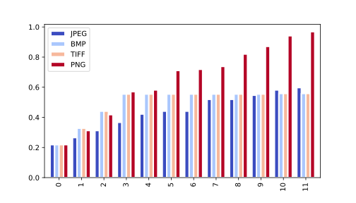

# Image Format vs Fossil Repo Size

## The Problem

Fossil has a [delta compression][dc] feature which removes redundant
information from a file — with respect to the version checked in at the
tip of the current working branch — when checking in a subsequent
version.¹ That delta is then [zlib][zl]-compressed before being stored
in the Fossil repository database file.

Storing pre-compressed data files in a Fossil repository defeats both of
these space-saving measures:

1.  Binary data compression algorithms — whether lossless as with zlib
    or lossy as with JPEG — turn the file data into [pseudorandom
    noise][prn].² 
    
    Typical data compression algorithms are not [hash functions][hf],
    where the goal is that a change to each bit in the input has a
    statistically even chance of changing every bit in the output, but
    because they do approach that pathological condition, pre-compressed
    data tends to defeat Fossil’s delta compression algorithm, there
    being so little correlation between two different outputs from the
    binary data compression algorithm.

2.  An ideal lossless binary data compression algorithm cannot be
    applied more than once to make the data even smaller, since random
    noise is incompressible.  The consequence for our purposes here is
    that pre-compressed data doesn’t benefit from Fossil’s zlib
    compression.

You might then ask, what does it matter if the space savings comes from
the application file format (e.g. JPEG, Zip, etc.) or from Fossil
itself? It really doesn’t, as far as point 2 above goes, but point 1
causes the Fossil repository to balloon out of proportion to the size of
the input data change on each checkin. This article will illustrate that
problem, quantify it, and give a solution to it.

[dc]:  ./delta_format.wiki
[hf]:  https://en.wikipedia.org/wiki/Hash_function
[prn]: https://en.wikipedia.org/wiki/Pseudorandomness
[zl]:  http://www.zlib.net/

## Affected File Formats

In this article’s core experiment, we use 2D image file formats, but
this article’s advice also applies to many other file types. For just a
few examples out of what must be thousands:

*   **Microsoft Office**: The [OOXML document format][oox] used from
    Office 2003 onward (`.docx`, `.xlsx`, `.pptx`, etc.) are Zip files
    containing an XML document file and several collateral files.

*   **Libre Office**: Its [ODF][odf] format is designed in more or less
    the same way as OOXML.

*   **Java**: A Java [`.jar` file][jcl] is a Zip file containing JVM
    `.class` files, manifest files, and more.

*   **Windows Installer:** An [`*.msi` file][wi] is a proprietary
    database format that contains, among other things, [Microsoft
    Cabinet][cab]-compressed files, which in turn may hold Windows
    executables, which [may themselves be compressed][exc].

*   **SVG, PDF, TIFF, etc.**: Many file formats are available in both
    compressed and uncompressed forms. You should use the uncompressed
    form with Fossil wherever practical, as we will show below.

[cab]: https://en.wikipedia.org/wiki/Cabinet_(file_format)
[exc]: https://en.wikipedia.org/wiki/Executable_compression
[jcl]: https://en.wikipedia.org/wiki/Java_(programming_language)
[odf]: https://en.wikipedia.org/wiki/OpenDocument
[oox]: https://en.wikipedia.org/wiki/Office_Open_XML
[wi]:  https://en.wikipedia.org/wiki/Windows_Installer

## Demonstration

The companion `image-format-vs-repo-size.ipynb` file ([download][nbd],
[preview][nbp]) is a [Jupyter][jp] notebook implementing the following
experiment:

1.  Create an empty Fossil repository; save its initial size.

2.  Use [ImageMagick][im] via [Wand][wp] to generate a JPEG file of a
    particular size — currently 256 px² — filled with Gaussian noise to
    make data compression more difficult than with a solid-color image.

3.  Check that image into the new Fossil repo, and remember that size.

4.  Change a random pixel in the image to a random RGB value, save that
    image, check it in, and remember the new Fossil repo size.

5.  Iterate on step 4 some number of times — currently 10 — and remember
    the Fossil repo size at each step.

6.  Repeat the above steps for BMP, TIFF,³ and PNG.

7.  Create a bar chart showing how the Fossil repository size changes
    with each checkin.

We chose to use Jupyter for this because it makes it easy for you to
modify the notebook to try different things.  Want to see how the
results change with a different image size?  Easy, change the `size`
value in the second cell of the notebook.  Want to try more image
formats?  You can put anything ImageMagick can recognize into the
`formats` list. Want to find the break-even point for images like those
in your own respository?  Easily done with a small amount of code.

[im]:  https://www.imagemagick.org/
[jp]:  https://jupyter.org/
[nbd]: ./image-format-vs-repo-size.ipynb
[nbp]: https://nbviewer.jupyter.org/urls/fossil-scm.org/fossil/doc/trunk/www/image-format-vs-repo-size.ipynb
[wp]:  http://wand-py.org/

## Results

Running the notebook gives a bar chart something like⁴ this:

There are a few key things we want to draw your attention to in that
chart:

*   BMP and uncompressed TIFF are nearly identical in size for all
    checkins, and the repository growth rate is negligible.⁵ We owe this
    economy to Fossil’s delta compression feature.

*   The JPEG and TIFF bars increase by large amounts on most checkins
    even though each checkin encodes only a *single-pixel change*!

*   Because JPEG’s lossy nature allows it to start smaller and have
    smaller size increases than than PNG, the crossover point with
    BMP/TIFF isn’t until 7-9 checkins in typical runs of this [Monte
    Carlo experiment][mce].  Given a choice among these four file
    formats and a willingness to use lossy image compression, a rational
    tradeoff is to choose JPEG for repositories where each image will
    change fewer than that number of times.

[mce]: https://en.wikipedia.org/wiki/Monte_Carlo_method

## Automated Recompression

Since programs that produce and consume binary-compressed data files
often make it either difficult or impossible to work with the
uncompressed form, we want an automated method for producing the
uncompressed form to make Fossil happy while still having the compressed
form to keep our content creation applications happy.  This `Makefile`
should⁶ do that for BMP, PNG, SVG, and XLSX files:

        .SUFFIXES: .bmp .png .svg .svgz

        .svgz.svg:
            gzip -dc < $< > $@

        .svg.svgz:
            gzip -9c < $< > $@

        .bmp.png:
            convert -quality 95 $< $@

        .png.bmp:
            convert $< $@

        SS_FILES := $(wildcard spreadsheet/*)

        all: $(SS_FILES) illus.svg image.bmp doc-big.pdf

        reconstitute: illus.svgz image.png
            ( cd spreadsheet ; zip -9 ../spreadsheet.xlsx) * )
            qpdf doc-big.pdf doc-small.pdf

        $(SS_FILES): spreadsheet.xlsx
            unzip $@ -d $<

        doc-big.pdf: doc-small.pdf
            qpdf --stream-data=uncompress $@ $<

This `Makefile` allows you to treat the compressed version as the
process input, but to actually check in only the changes against the
uncompressed version by typing “`make`” before “`fossil ci`”. This is
not actually an extra step in practice, since if you’ve got a
`Makefile`-based project, you should be building (and testing!) it
before checking each change in anyway!

Because this technique is based on dependency rules, only the necessary
files are generated on each `make` command.

You only have to run “`make reconstitute`” *once* after opening a fresh
Fossil checkout to produce those compressed sources. After that, you
work with the compressed files in your content creation programs. Your
build system might include some kind of bootstrapping or
auto-configuration step that you could attach this to, so that it
doesn’t need to be run by hand.

This `Makefile` illustrates two primary strategies:

### Input and Ouput File Formats Differ by Extension

In the case of SVG and the bitmap image formats, the file name extension
differs between the cases, so we can use `make` suffix rules to get the
behavior we want.  The top half of the `Makefile` just tells `make` how
to map from `*.svg` to `*.svgz` and vice versa, and the same for `*.bmp`
to/from `*.png`.

### Input and Output Use the Same Extension

We don’t have that luxury for Excel and PDF files, each for a different
reason:

*   **Excel:** Excel has no way to work with the unpacked Zip file
    contents at all, so we have to unpack it into a subdirectory, which
    is what we check into Fossil.  On making a fresh Fossil checkout, we
    have to pack that subdirectory’s contents back up into an `*.xlsx`
    file with “`make reconstitute`” so we can edit it with Excel again.

*   **PDF:** All PDF readers can display an uncompressed PDF file, but
    many PDF-*producing* programs have no option for uncompressed
    output.  Since the file name extension is the same either way, we
    treat the compressed PDF as the source to the process, yielding an
    automatically-uncompressed PDF for the benefit of Fossil.  Unlike
    with the Excel case, there is no simple “file base name to directory
    name” mapping, so we just created the `-big` to `-small` name scheme
    here.

----

## Footnotes and Digressions

1.  Several other programs also do delta compression, so they’ll also be
    affected by this problem: [rsync][rs], [Unison][us], [Git][git],
    etc. When using file copying and synchronization programs *without*
    delta compression, it’s best to use the most highly-compressed file
    format you can tolerate, since they copy the whole file any time any
    bit of it changes.

2.  In fact, a good way to gauge the effectiveness of a given
    compression scheme is to run its output through the same sort of
    tests we use to gauge how “random” a given [PRNG][prng] is.  Another
    way to look at it is that if there is a discernible pattern in the
    output of a compression scheme, it’s information that could be
    further compressed.

3.  We're using *uncompressed* TIFF here, not [LZW][lzw]- or
    Zip-compressed TIFF, either of which would give similar results to
    PNG, which is always zlib-compressed.

4.  The raw data changes somewhat from one run to the next due to the
    use of random noise in the image to make the zlib/PNG compression
    more difficult, and the random pixel changes.  Those test design
    choices make this a [Monte Carlo experient][mce].  We’ve found that
    the overall character of the results doesn’t change from one run to
    the next.

    The code in the notebook’s third cell drops the first three columns
    of data because the first column (the empty repository size) is
    boring, and the subsequent two checkins show the SQLite DB file
    format settling in with its first few checkins. There’s a single
    line in the notebook you can comment out to get a bar chart with
    these data included.

    If you do this, you’ll see a mildly interesting result: the size of
    the first checkin in the BMP and TIFF cases is roughly the same as
    that for the PNG case, because both PNG and Fossil use the zlib
    binary data compression algorithm.

5.  A low-tech format like BMP will have a small edge in practice
    because TIFF metadata includes the option for multiple timestamps,
    UUIDs, etc., which bloat the checkin size by creating many small
    deltas.  If you don't need the advantages of TIFF, a less capable
    image file format will give smaller checkin sizes for a given amount
    of change.

6.  The `Makefile` above is not battle-tested.  Please report bugs and
    needed extensions [on the forum][for].

[for]:  https://fossil-scm.org/forum/forumpost/15e677f2c8
[git]:  https://git-scm.com/
[lzw]:  https://en.wikipedia.org/wiki/Lempel%E2%80%93Ziv%E2%80%93Welch
[prng]: https://en.wikipedia.org/wiki/Pseudorandom_number_generator
[rs]:   https://rsync.samba.org/
[us]:   http://www.cis.upenn.edu/~bcpierce/unison/
