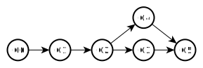
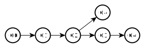
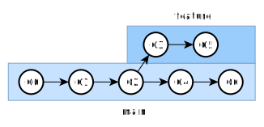
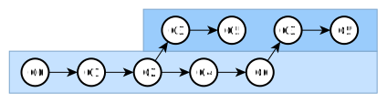
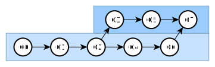

# Rebase Considered Harmful

Fossil deliberately omits a "rebase" command, because the original
designer of Fossil (and [original author][vhist] of this article) considers rebase to be 
an anti-pattern to be avoided. This article attempts to
explain that point of view.

[vhist]: /finfo?name=www/rebaseharm.md&ubg

## 1.0 Rebasing is dangerous

Most people, even strident advocates of rebase, agree that rebase can
cause problems when misused. The Git rebase documentation talks about the
[golden rule of rebase][golden]: that it should never be used on a public
branch.  Horror stories of misused rebase abound, and the rebase 
documentation devotes considerable space toward explaining how to
recover from rebase errors and/or misuse.

## 2.0 Rebase provides no new capabilities

Sometimes sharp and dangerous tools are justified,
because they accomplish things that cannot be
done otherwise, or at least cannot be done easily.
Rebase does not fall into that category,
because it provides no new capabilities.

### 2.1 A rebase is just a merge with historical references omitted

A rebase is really nothing more than a merge (or a series of merges)
that deliberately forgets one of the parents of each merge step.
To help illustrate this fact,
consider the first rebase example from the 
[Git documentation][gitrebase].  The merge looks like this:

And the rebase looks like this:

As the [Git documentation][gitrebase] points out, check-ins C4\' and C5
are identical.  The only difference between C4\' and C5 is that C5
records the fact that C4 is its merge parent but C4\' does not.

Thus, a rebase is just a merge that forgets where it came from.

The Git documentation acknowledges this fact (in so many words) and
justifies it by saying "rebasing makes for a cleaner history."  I read
that sentence as a tacit admission that the Git history display 
capabilities are weak and need active assistance from the user to 
keep things manageable.
Surely a better approach is to record
the complete ancestry of every check-in but then fix the tool to show
a "clean" history in those instances where a simplified display is
desirable and edifying, but retain the option to show the real,
complete, messy history for cases where detail and accuracy are more
important.

So, another way of thinking about rebase is that it is a kind of
merge that intentionally forgets some details in order to
not overwhelm the weak history display mechanisms available in Git.

### 2.2 Rebase does not actually provide better feature-branch diffs

Another argument, often cited, is that rebasing a feature branch
allows one to see just the changes in the feature branch without
the concurrent changes in the main line of development. 
Consider a hypothetical case:

In the above, a feature branch consisting of check-ins C3 and C5 is
run concurrently with the main line in check-ins C4 and C6.  Advocates
for rebase say that you should rebase the feature branch to the tip
of main like the following:

You could choose to collapse C3\' and C5\' into a single check-in
as part of this rebase, but that’s a side issue we’ll deal with
[separately](#collapsing).

If only merge is available, one would do a merge from the concurrent
mainline changes into the feature branch as follows:

Check-ins C5\' and C7 check-ins hold identical code.  The only
difference is in their history.  

The argument from rebase advocates
is that with merge it is difficult to see only the changes associated
with the feature branch without the commingled mainline changes.
In other words, diff(C2,C7) shows changes associated both the feature
branch and from the mainline, whereas in the rebase case
diff(C6,C5\') should only the feature branch changes.

But that argument is comparing apples to oranges, since the two diffs
do not have the same baseline.  The correct way to see only the feature
branch changes in the merge case is not diff(C2,C7) but rather diff(C6,C7).

<table border="1" cellpadding="5" cellspacing="0">
<tr><th>Rebase<th>Merge<th>What You See
<tr><td>diff(C2,C5\')<td>diff(C2,C7)<td>Commingled branch and mainline changes
<tr><td>diff(C6,C5\')<td>diff(C6,C7)<td>Branch changes only
</table>

Remember: C7 and C5\' are bit-for-bit identical, so the output of the
diff is not determined by whether you select C7 or C5\' as the target
of the diff, but rather by your choice of the diff source, C2 or C6.

So, to help with the problem of viewing changes associated with a feature
branch, perhaps what is needed is not rebase but rather better tools to 
help users identify an appropriate baseline for their diffs.

## 3.0 Rebase encourages siloed development

The [golden rule of rebase][golden] is that you should never do it
on public branches, so if you are using rebase as intended, that means
you are keeping private branches.  Or, to put it another way, you are
doing siloed development.  You are not sharing your intermediate work
with collaborators.  This is not good for product quality.

[Nagappan, et. al][nagappan] studied bugs in Windows Vista and found
that best predictor of bugs is the distance on the org-chart between
the stake-holders.  Or, bugs are reduced when the engineers talk to
one another.  Similar findings arise in other disciplines.  Keeping
private branches does not prove that developers are communicating
insufficiently, but it is a key symptom that problem.

[Weinberg][weinberg] argues programming should be "egoless."  That
is to say, programmers should avoid linking their code with their sense of
self, as that makes it more difficult for them to find and respond
to bugs, and hence makes them less productive.  Many developers are
drawn to private branches out of sense of ego.  "I want to get the
code right before I publish it."  I sympathize with this sentiment,
and am frequently guilty of it myself.  It is humbling to display
your stupid mistake to the whole world on an internet that
never forgets.  And yet, humble programmers generate better code.

What is the fastest path to solid code? Is it to continue staring at
your private branch to seek out every last bug, or is it to publish it
as-is, whereupon the many eyeballs will immediately see that last stupid
error in the code? Testing and development are often done by separate
groups within a larger software development organization, because
developers get too close to their own code to see every problem in it.

Given that, is it better for those many eyeballs to find your problems
while they’re still isolated on a feature branch, or should that vetting
wait until you finally push a collapsed version of a private working
branch to the parent repo? Will the many eyeballs even see those errors
when they’re intermingled with code implementing some tasty new feature?

## 4.0 Rebase commits untested check-ins to the blockchain

Rebase adds new check-ins to the blockchain without giving the operator
an opportunity to test and verify those check-ins.  Just because the
underlying three-way merge had no conflict does not mean that the resulting
code actually works.  Thus, rebase runs the very real risk of adding
non-functional check-ins to the permanent record.

Of course, a user can also commit untested or broken check-ins without
the help of rebase.  But at least with an ordinary commit or merge
(in Fossil at least), the operator
has the *opportunity* to test and verify the merge before it is committed,
and a chance to back out or fix the change if it is broken, without leaving
busted check-ins on the blockchain to complicate future bisects.

With rebase, pre-commit testing is not an option.

## 5.0 Rebase causes timestamp confusion

Consider the earlier example of rebasing a feature branch:

What timestamps go on the C3\' and C5\' check-ins?  If you choose
the same timestamps as the original C3 and C5, then you have the
odd situation C3' is older than its parent C6.  We call that a
"timewarp" in Fossil.  Timewarps can also happen due to misconfigured
system clocks, so they are not unique to rebase.  But they are very
confusing and best avoided.  The other option is to provide new
unique timestamps for C3' and C5'.  But then you lose the information
about when those check-ins were originally created, which can make
historical analysis of changes more difficult, and might also
complicate prior art claims.

## 6.0 Rebasing is lying about the project history

By discarding parentage information, rebase attempts to deceive the
reader about how the code actually came together.

The [Git rebase documentation][gitrebase] admits as much.  They acknowledge
that when you view a repository as record of what actually happened,
doing a rebase is "blasphemous" and "you're _lying_ about what
actually happened", but then goes on to justify rebase as follows:

>
_"The opposing point of view is that the commit history is the **story of 
how your project was made.** You wouldn\'t publish the first draft of a 
book, and the manual for how to maintain your software deserves careful
editing. This is the camp that uses tools like rebase and filter-branch 
to tell the story in the way that’s best for future readers."_

The problem with this counter-argument is that it assumes you must
change history in order to enhance readability.
And, in fairness to the Git documentation authors, changing the
project history appears to be the only way to make editorial
changes in Git.

But it does not have to be that way.
Fossil supports improvements to "the story of how your project
was made" without changing the actual history of your project
by allowing users to:

  1.  Edit check-in comments to fix typos or enhance clarify
  2.  Attaching supplemental notes to check-ins or whole branches
  3.  Cross-referencing check-ins with each other, or with
      wiki, tickets, forum posts, and/or embedded documentation
  4.  Cause mistaken or unused branches to be hidden from
      routine display
  5.  Fix faulty check-in date/times resulting from misconfigured
      system clocks
  6.  And so forth....

These changes are accomplishes not by removing or modifying existing
repository entries, but rather by adding new supplimental records.
The original incorrect or unclear inputs are preserved and are
readily accessible.  The original history is preserved.
But for routine display purposes, the more
readable edited presentation is provided.

A repository can be a true and accurate
representation of history even without getting everything perfect
on the first draft.  Those are not contradictory goals, at least
not in theory.

Unfortunately, Git does not provide the ability to add corrections
or clarifications to historical check-ins.  Hence, once again,
rebase can be seen as an attempt to work around limitations
of Git.  Wouldn't it be better to fix the tool rather than 
fabricate a fictious project history?

## 7.0 Collapsing check-ins throws away valuable information

One of the oft-cited advantages of rebasing in Git is that it lets you
collapse multiple check-ins down to a single check-in to make the
development history “clean.” The intent is that development appear as
though every feature were created in a single step: no multi-step
evolution, no back-tracking, no false starts, no mistakes. This ignores
actual developer psychology: ideas rarely spring forth from fingers to
files in faultless finished form. A wish for collapsed, finalized
check-ins is a wish for a counterfactual situation.

The common counterargument is that collapsed check-ins represent a
better world, the ideal we’re striving for. What that argument overlooks
is that we must throw away valuable information to get there.

### 7.1 Individual check-ins support developer empathy

Ideally, future developers of our software can understand every feature
in it using only context available in the version of the code they start
work with. Prior to widespread version control, developers had no choice
but to work that way.  Pre-existing codebases could only be understood
as-is or not at all.  Developers in that world had an incentive to
develop software that was easy to understand retrospectively, even if
they were selfish people, because they knew they might end up being
those future developers!

Yet, sometimes we come upon a piece of code that we simply cannot
understand. If you have never asked yourself, “What was this code’s
developer thinking?” you haven’t been developing software for very long.

When a developer can go back to the individual check-ins leading up to
the current code, they can work out the answers to such questions using
only the level of empathy necessary to be a good developer. To
understand such code using only the finished form, you are asking future
developers to make intuitive leaps that the original developer was
unable to make. In other words, you are asking your future maintenance
developers to be smarter than the original developers!  That’s a
beautiful wish, but there’s a sharp limit to how far you can carry it.
Eventually you hit the limits of human brilliance.

When the operation of some bit of code is not obvious, both Fossil and
Git let you run a [`blame`](/help?cmd=blame) on the code file to get
information about each line of code, and from that which check-in last
touched a given line of code. If you squash the check-ins on a branch
down to a single check-in, you throw away the information leading up to
that finished form. Fossil not only preserves the check-ins surrounding
the one that included the line of code you’re trying to understand, its
[superior data model][sdm] lets you see the surrounding check-ins in
both directions; not only what lead up to it, but what came next. Git
can’t do that short of crawling the block-chain backwards from the tip
of the branch to the check-in you’re looking at, an expensive operation.

We believe it is easier to understand a line of code from the 10-line
check-in it was a part of — and then to understand the surrounding
check-ins as necessary — than it is to understand a 500-line check-in
that collapses a whole branch’s worth of changes down to a single
finished feature.

[sdm]: ./fossil-v-git.wiki#durable

### 7.2 Bisecting works better on small check-ins

Git lets a developer write a feature in ten check-ins but collapse it
down to an eleventh check-in and then deliberately push only that final
collapsed check-in to the parent repo. Someone else may then do a bisect
that blames the merged check-in as the source of the problem they’re
chasing down; they then have to manually work out which of the 10 steps
the original developer took to create it to find the source of the
actual problem.

Fossil pushes all 11 check-ins to the parent repository by default, so
that someone doing that bisect sees the complete check-in history, so
the bisect will point them at the single original check-in that caused
the problem.

### 7.3 Multiple check-ins require multiple check-in comments

The more comments you have from a given developer on a given body of
code, the more concise documentation you have of that developer’s
thought process. To resume the bisecting example, a developer trying to
work out what the original developer was thinking with a given change
will have more success given a check-in comment that explains what the
one check-in out of ten blamed by the “bisect” command was trying to
accomplish than if they must work that out from the eleventh check-in’s
comment, which only explains the “clean” version of the collapsed
feature.

### 7.4 Cherry-picks work better with small check-ins

While working on a new feature in one branch, you may come across a bug
in the pre-existing code that you need to fix in order for work on that
feature to proceed. You could choose to switch briefly back to the
parent branch, develop the fix there, check it in, then merge the parent
back up to the feature branch in order to continue work, but that’s
distracting. If the fix isn’t for a critical bug, fixing it on the
parent branch can wait, so it’s better to maintain your mental working
state by fixing the problem in place on the feature branch, then check
the fix in on the feature branch, resume work on the feature, and later
merge that fix down into the parent branch along with the feature.

But now what happens if another branch *also* needs that fix? Let us say
our code repository has a branch for the current stable release, a
development branch for the next major version, and feature branches off
of the development branch. If we rebase each feature branch down into
the development branch as a single check-in, pushing only the rebase
check-in up to the parent repo, only that fix’s developer has the
information locally to perform the cherry-pick of the fix onto the
stable branch.

Developers working on new features often do not care about old stable
versions, yet that stable version may have an end user community that
depends on that version, who either cannot wait for the next stable
version or who wish to put off upgrading to it for some time. Such users
want backported bug fixes, yet the developers creating those fixes have
poor incentives to provide those backports.  Thus the existence of
maintenance and support organizations, who end up doing such work.
(There is [a famous company][rh] that built a multi-billion dollar
enterprise on such work.)

This work is far easier when each cherry-pick transfers completely and
cleanly from one branch to another, and we increase the likelihood of
achieving that state by working from the smallest check-ins that remain
complete. If a support organization must manually disentangle a fix from
a feature check-in, they are likely to introduce new bugs on the stable
branch. Even if they manage to do their work without error, it takes
them more time to do the cherry-pick that way.

[rh]: https://en.wikipedia.org/wiki/Red_Hat

### 7.5 Back-outs also work better with small check-ins

The inverse of the cherry-pick merge is the back-out merge. If you push
only a collapsed version of a private working branch up to the parent
repo, those working from that parent repo cannot automatically back out
any of the individual check-ins that went into that private branch.
Others must either manually disentangle the problematic part of your
merge check-in or back out the entire feature.

## 8.0 Cherry-pick merges work better than rebase

Perhaps there are some cases where a rebase-like transformation
is actually helpful.  But those cases are rare.  And when they do
come up, running a series of cherry-pick merges achieve the same
topology, but with advantages:

  1.  Cherry-pick merges preserve an honest record of history.
      (They do in Fossil at least.  Git's file format does not have
      a slot to record cherry-pick merge history, unfortunately.)

  2.  Cherry-picks provide an opportunity to [test each new check-in
      before it is committed][tbc] to the blockchain

  3.  Cherry-pick merges are "safe" in the sense that they do not
      cause problems for collaborators if you do them on public branches.

  4.  Cherry-picks keep both the original and the revised check-ins,
      so both timestamps are preserved.

[tbc]: ./fossil-v-git.wiki#testing

## 9.0 Summary and conclusion

Rebasing is an anti-pattern.  It is dishonest.  It deliberately
omits historical information.  It causes problems for collaboration.
And it has no offsetting benefits.

For these reasons, rebase is intentionally and deliberately omitted
from the design of Fossil.

[golden]: https://www.atlassian.com/git/tutorials/merging-vs-rebasing#the-golden-rule-of-rebasing
[gitrebase]: https://git-scm.com/book/en/v2/Git-Branching-Rebasing
[nagappan]: https://www.microsoft.com/en-us/research/wp-content/uploads/2016/02/tr-2008-11.pdf
[weinberg]: https://books.google.com/books?id=76dIAAAAMAAJ
