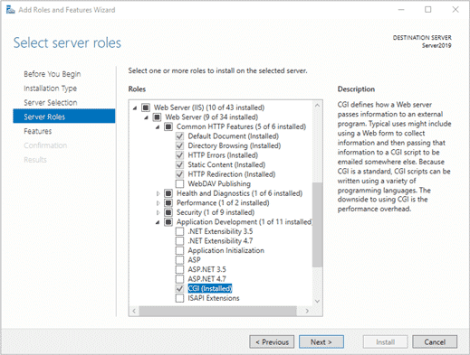
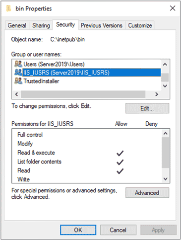
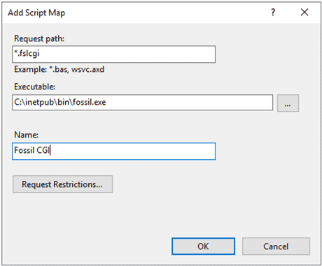
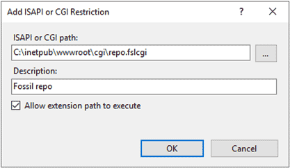

# Serving via IIS + CGI

## This Is Not the Method You Are Looking For

Setting up CGI service under IIS is surprisingly complicated compared to
running Fossil as a CGI under most other operating systems. We recommend
that you use the simpler [reverse proxying method](./iis.md) instead
unless there is some compelling reason why that method cannot work for
you, such as its dependence on non-stock IIS extensions. (Keep in mind
that both extensions it requires are by Microsoft, not third parties!)

Once you’ve got this scheme working, it gives the same benefits as those
listed at the top of the linked-to document.

There is a small benefit you get from using CGI over reverse proxying on
other OSes, which is that the Fossil program only runs briefly in order
to serve each HTTP hit.  Once the request is done, that Fossil instance
shuts back down, releasing all of its resources. You don’t need to keep
a background Fossil HTTP server running full-time to provide CGI-based
Fossil service.

You lose a lot of that benefit on Windows:

1.  It only matters to start with on servers that are highly RAM
    constrained.  (Roughly &le; 128 MiB.)  Our configuration steps below
    assume you’re using the Windows and IIS GUIs, which have RAM
    requirements well in excess of this, making Fossil’s resource
    requirements a drop in the bucket next to them. On the [Azure
    B1s][b1s] virtual machine I used to prepare these instructions, the
    Windows Server Manager GUI kept filling the VM’s 1&nbsp;GiB of RAM
    during feature installation and crashing. I had to upgrade the VM’s
    RAM to 2&nbsp;GiB just to get useful work done!

2.  Process creation on Windows is [much more expensive][cp] than on the
    other OSes Fossil runs on, so the benefits of firing up a Fossil
    executable to process each HTTP request are partially swamped by the
    overhead of doing so.

Therefore, unless you’re willing to replace all of the GUI configuration
steps below with command line equivalents, or shut the GUI down entirely
after configuring IIS, CGI is a much less compelling option on Windows.

**WARNING:** The following tutorial appears to fail with the current
(2019-08-17) version of Fossil, [apparently][fbug] due to an inability
of Fossil to detect that it’s being run in CGI mode.

[b1s]:  https://azure.microsoft.com/en-us/blog/introducing-b-series-our-new-burstable-vm-size/
[cp]:   https://stackoverflow.com/a/48244/142454
[fbug]: https://fossil-scm.org/forum/forumpost/de18dc32c0

## Install IIS with CGI Support

The steps for this are identical to those for the [reverse proxying IIS
setup](./iis.md#install) except that you need to enable CGI in the last
step, since it isn’t installed by default. For Windows Server, the path
is:

The path is similar on the consumer-focused versions of Windows, once
you get to that last step.

## Setup

1.  Install the Fossil executable to `c:\inetpub\wwwroot\bin` on the web
    server. We can’t use an executable you might already have because IIS
    runs under a separate user account, so we need to give that
    executable special permissions, and that’s easiest to do under the
    IIS tree:

    

2.  In IIS Manager (a.k.a. `INETMGR`) drill down into the Sites folder
    in the left-side pane and right-click your web site’s
    configuration. (e.g. “Default Web Site”)

3.  On that menu say “Add Virtual Directory.” Give it the alias “`cgi`”
    and point it at a suitable directory, such as
    “`c:\inetpub\wwwroot\cgi`”.

4.  Double-click the “Handler Mappings” icon, then in the right-side
    pane, click “Add Script Map...” Apply the following settings:

    

    The Executable path must point to the path we set up in step 1, not
    to some other `fossil.exe` you may have elsewhere on your system.
    You will need to change the default “`*.dll`” filter in the Open
    dialog to “`*.exe`” in order to see it when browsing via the “`...`”
    button.

5.  Create a file called `repo.fslcgi` within the CGI directory you
    chose in step 3, with a single line like this:

        repository: c:\Users\SOMEONE\museum\repo.fossil

    Give the actual path to the repository, of course.

6.  Up at the top level of IIS Manager, double-click the “ISAPI and CGI
    Restrictions” icon, then click “Add...” in the right-side pane.
    Give the script you just created permission to execute:

    

7.  In the right-side pane, click “Restart” to apply this configuration,
    then test it by visiting the newly-available URL in a browser:

        http://localhost/cgi/repo.fslcgi

For more complicated setups such as “directory” mode, see [the generic
CGI instructions](../any/cgi.md).

*[Return to the top-level Fossil server article.](../)*
