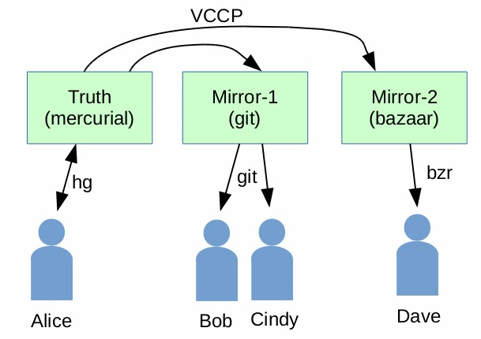
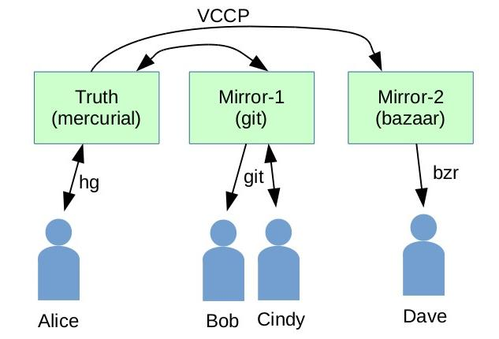

Version Control Collaboration Protocol
======================================

<blockquote>

This document is a work in progress. 
The last update was on 2019-03-09. 
Check back later for updates.

</blockquote>

1.0 Introduction
----------------

The Version Control Collaboration Protocol or VCCP is an attempt to make
it easier for developers to collaborate even when they are using different
version control systems.

For example, suppose Alice, the founder and
[BDFL](https://en.wikipedia.org/wiki/Benevolent_dictator_for_life)
for the fictional "BambooCoffee" project, prefers using the
[Mercurial](https://www.mercurial-scm.org/) version control system,
but two of her clients, Bob and Cindy, know nothing but
[Git](https://www.git-scm.org/) and steadfastly refuse to
type any command that begins with "hg", and an important
collaborator, Dave, really prefers [Bazaar](bazaar.canonical.com/).
The VCCP is designed to make it relatively easy and painless
for Alice to set up Git and Bazaar mirrors of her Mercurial
repository so that Bob, Cindy, and Dave can all use the tools with
which they are most familiar.

Assuming all the servers speak VCCP (which is not the case at the
time of this writing, but we hope to encourage that for the future)
then whenever Alice checks in a new change to her primary repository
(here labeled "Truth") that repository sends a VCCP message to the
two mirrors which causes them to pick up the changes as well.

### 1.1 Bidirectional Collaboration

The diagram above shows that all changes originate from Alice and
that Bob, Cindy, and David are only consumers. If Cindy wanted to
make a change to BambooCoffee, she would have to do that with a backchannel,
such as sending a patch via email to Alice and then get Alice to check
in the change.

But VCCP also support bidirectional collaboration.

If Cindy is a frequent contributor, and assuming that Git and Mercurial
are compatible version control systems (which I believe they are) then
VCCP can be used to move information from Truth to Mirror-1 and from Mirror-1
back to Truth.  In that configuration, Cindy would be able to check in her
changes using the "git" command.  The Mirror-1 server would then send a
VCCP message back to Truth containing Cindy's changes.  Truth would then
relay those changes over to Mirror-2 where Dave could see them as well.

### 1.2 Client-Mirror versus Server-Mirror

VCCP allows the mirrors to be set up as either clients or server.

In the client-mirror approach, the mirrors periodically poll Truth asking
for changes.  In the server-mirror approach, Truth sends changes to the
mirrors as they occur.

In the first example above, the implication was that the server-mirror
approach was being used.  The Truth repository would take the initiative
to send changes to the mirrors. But it does not have to be that way.
Suppose Dave is unknown to Alice.  Suppose he just likes Alice's work and
wants to keep his own mirror for his own convenience.  Dave could set up
Mirror-2 as a client-mirror that periodically polls Truth for changes.

In the second example above, Truth and Mirror-1 could be configured to
have a Peer-to-Peer relationship rather than a Truth-to-Mirror relationship.
When new content arrives a Truth (because Alice did an "hg commit"), 
Truth acts as a client to initiate a transfer of that new information 
over to Mirror-1.  When new content originates at Mirror-1 (because
Cindy did "git commit") then Mirror-1 acts as a client to send a the new
content over the Truth.  Or, they could set it up so that Truth is always
the client and it periodically polls Mirror-1 looking for new content
coming from Cindy.  Or, they could set it up so that Mirror-1 is always
the client and it periodically polls Truth looking for changes from Alice.

The point is that VCCP works in all of these scenarios.

2.0 Minimum Requirements
------------------------

The VCCP is modeled after the Git fast-export and fast-import protocol.
That is to say, VCCP thinks in terms of "check-ins" with each check-in
consisting of a number of files (or "Blobs" in git-speak).  Any version
control system that wants to use VCCP needs to also be able to think
in those terms.

Since VCCP is modeled after fast-import, it has the concept of a tag.  
But the use of tags is optional and
VCCP will work with systems that do not support tags.

VCCP assumes that most check-ins have a parent check-in from which it
was derived. Obviously, the first check-in for a project does not have
a parent, but all the others should.  Check-ins may also identify
zero or more "merge" parents, and zero or more "cherrypick" ancestors.
But the merges and cherrypicks can be ignored on systems that do not
support those concepts.

VCCP assumes that every distinct version of a file, and every check-in has
a unique name.  In Git and Mercurial, those names are SHA1 hashes
(computed in different ways).  Fossil uses SHA3-256 hashes.  I'm not sure
what Bazaar uses.  VCCP does not care how the names are derived, as long
as they always uniquely identify the file or check-in.

VCCP assumes that each check-in has a commit comment and a "committer"
and a timestamp for when the commit occurred.  We hope that the timestamps
are well-ordered in the sense that each check-in comes after its predecessor,
though this is not a requirement.  VCCP will continue to work even if
the timestamps are out of order, perhaps due to a misconfigured system clock
on the workstation of one of the collaborators.

3.0 Protocol Overview
---------------------

The VCCP is a client-server protocol.
A client formats a VCCP message and sends it to the server.
The server acts upon that message, formulates a reply, and sends
the reply back to the client.
